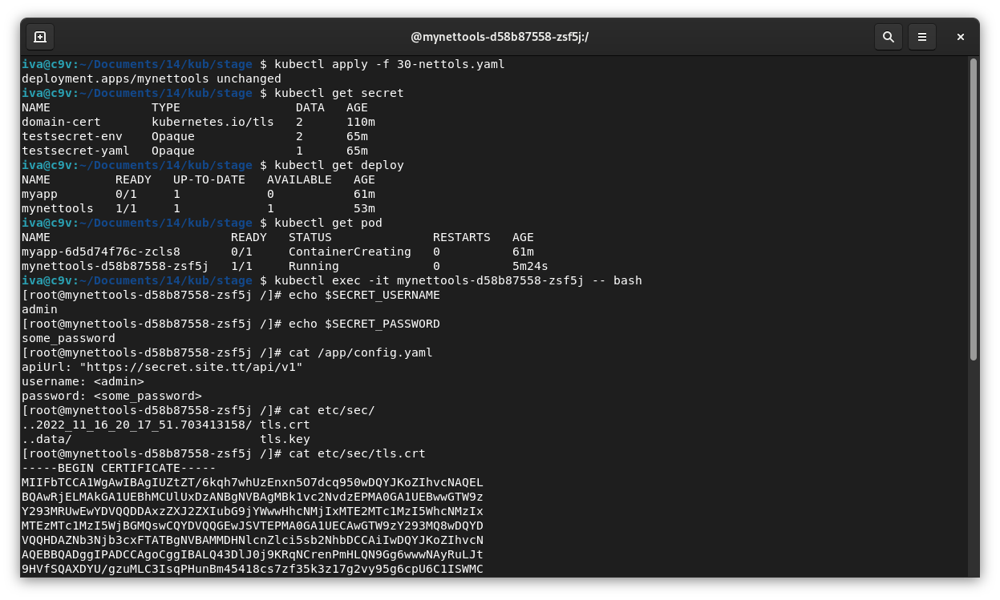

# Домашнее задание к занятию "14.1 Создание и использование секретов"

## Задача 1: Работа с секретами через утилиту kubectl в установленном minikube

Выполните приведённые ниже команды в консоли, получите вывод команд. Сохраните
задачу 1 как справочный материал.

<details>
    <summary>Задание 1</summary>

### Как создать секрет?

```
openssl genrsa -out cert.key 4096
openssl req -x509 -new -key cert.key -days 3650 -out cert.crt \
-subj '/C=RU/ST=Moscow/L=Moscow/CN=server.local'
kubectl create secret tls domain-cert --cert=certs/cert.crt --key=certs/cert.key
```

### Как просмотреть список секретов?

```
kubectl get secrets
kubectl get secret
```

### Как просмотреть секрет?

```
kubectl get secret domain-cert
kubectl describe secret domain-cert
```

### Как получить информацию в формате YAML и/или JSON?

```
kubectl get secret domain-cert -o yaml
kubectl get secret domain-cert -o json
```

### Как выгрузить секрет и сохранить его в файл?

```
kubectl get secrets -o json > secrets.json
kubectl get secret domain-cert -o yaml > domain-cert.yml
```

### Как удалить секрет?

```
kubectl delete secret domain-cert
```

### Как загрузить секрет из файла?

```
kubectl apply -f domain-cert.yml
```
</details>


<details>
    <summary>Выполнение задания 1</summary>

```bash
iva@c9v:~/Documents/14 $ kubectl get pods
No resources found in default namespace.
iva@c9v:~/Documents/14 $ kubectl get ns
NAME              STATUS   AGE
default           Active   49d
kube-node-lease   Active   49d
kube-public       Active   49d
kube-system       Active   49d
iva@c9v:~/Documents/14 $ kubectl get pods
No resources found in default namespace.
iva@c9v:~/Documents/14 $ kubectl get secret
No resources found in default namespace.
iva@c9v:~/Documents/14 $ kubectl get secrets
No resources found in default namespace.
```

```bash
iva@c9v:~/Documents/14 $ mkdir certs
iva@c9v:~/Documents/14 $ cd certs/
iva@c9v:~/Documents/14/certs $ openssl genrsa -out cert.key 4096
iva@c9v:~/Documents/14/certs $ openssl req -x509 -new -key cert.key -days 3650 -out cert.crt -subj '/C=RU/ST=Moscow/L=Moscow/CN=server.local'
iva@c9v:~/Documents/14/certs $ cd ..
iva@c9v:~/Documents/14 $ kubectl create secret tls domain-cert --cert=certs/cert.crt --key=certs/cert.key
secret/domain-cert created
iva@c9v:~/Documents/14 $ kubectl get secrets
NAME          TYPE                DATA   AGE
domain-cert   kubernetes.io/tls   2      39s
iva@c9v:~/Documents/14 $ kubectl get secret
NAME          TYPE                DATA   AGE
domain-cert   kubernetes.io/tls   2      48s
```

```bash
iva@c9v:~/Documents/14 $ kubectl get secret domain-cert
NAME          TYPE                DATA   AGE
domain-cert   kubernetes.io/tls   2      83s
iva@c9v:~/Documents/14 $ kubectl describe secret domain-cert
Name:         domain-cert
Namespace:    default
Labels:       <none>
Annotations:  <none>

Type:  kubernetes.io/tls

Data
====
tls.crt:  1944 bytes
tls.key:  3272 bytes

```

```bash
iva@c9v:~/Documents/14 $ kubectl get secret domain-cert -o yaml
apiVersion: v1
data:
  tls.crt: LS0tLS1CRUdJTiBDRVJUSUZJQ0FURS0tLS0tCk1JSUZiVENDQTFXZ0F3SUJBZ0lVWnRa<cut>
  tls.key: LS0tLS1CRUdJTiBQUklWQVRFIEtFWS0tLS0tCk1JSUpRZ0lCQURBTkJna3Foa2lHOXcw<cut>
kind: Secret
metadata:
  creationTimestamp: "2022-11-16T17:53:44Z"
  name: domain-cert
  namespace: default
  resourceVersion: "16429"
  uid: e5b588f7-f1d0-4348-87e0-ab4aed8978e2
type: kubernetes.io/tls

```

```bash
iva@c9v:~/Documents/14 $ kubectl get secret domain-cert -o json
{
    "apiVersion": "v1",
    "data": {
        "tls.crt": "LS0tLS1CRUdJTiBDRVJUSUZJQ0FURS0tLS0tCk1JSUZiVENDQTFXZ0F3SUJBZ0lVWnRa<cut>",
        "tls.key": "LS0tLS1CRUdJTiBQUklWQVRFIEtFWS0tLS0tCk1JSUpRZ0lCQURBTkJna3Foa2lHOXcw<cut>"
    },
    "kind": "Secret",
    "metadata": {
        "creationTimestamp": "2022-11-16T17:53:44Z",
        "name": "domain-cert",
        "namespace": "default",
        "resourceVersion": "16429",
        "uid": "e5b588f7-f1d0-4348-87e0-ab4aed8978e2"
    },
    "type": "kubernetes.io/tls"
}

```

```bash
iva@c9v:~/Documents/14 $ kubectl delete secret domain-cert
secret "domain-cert" deleted
iva@c9v:~/Documents/14 $ kubectl get secrets
No resources found in default namespace.
```

```bash
iva@c9v:~/Documents/14 $ kubectl apply -f domain-cert.yml
secret/domain-cert created
iva@c9v:~/Documents/14 $ kubectl get secrets
NAME          TYPE                DATA   AGE
domain-cert   kubernetes.io/tls   2      7s
```

 Секреты доступны в зависимости от используемого namespace

```bash
iva@c9v:~/Documents/14 $ kubectl get ns
NAME              STATUS   AGE
default           Active   49d
kube-node-lease   Active   49d
kube-public       Active   49d
kube-system       Active   49d
stage             Active   25s
iva@c9v:~/Documents/14 $ kubectl config set-context --current --namespace=default
Context "kubernetes-admin@cluster.local" modified.
iva@c9v:~/Documents/14 $ kubectl get ns
NAME              STATUS   AGE
default           Active   49d
kube-node-lease   Active   49d
kube-public       Active   49d
kube-system       Active   49d
stage             Active   43s
iva@c9v:~/Documents/14 $ kubectl get secret
NAME          TYPE                DATA   AGE
domain-cert   kubernetes.io/tls   2      3m40s
```
</details>

[Данные сертификата и результат экспорта секрета](./14.1/certs/)

## Задача 2 (*): Работа с секретами внутри модуля

Выберите любимый образ контейнера, подключите секреты и проверьте их доступность
как в виде переменных окружения, так и в виде примонтированного тома.

---

### Как оформить ДЗ?

Выполненное домашнее задание пришлите ссылкой на .md-файл в вашем репозитории.

В качестве решения прикрепите к ДЗ конфиг файлы для деплоя. Прикрепите скриншоты вывода команды kubectl со списком запущенных объектов каждого типа (deployments, pods, secrets) или скриншот из самого Kubernetes, что сервисы подняты и работают, а также вывод из CLI.



Конфиг файлы для деплоя:

[Секреты](./14.1/stage/20-secrets.yaml)

[Деплой приложения](./14.1/stage/30-nettols.yaml)

[Секрет из задания 1](./14.1/stage/domain-cert.yaml)

<details>
    <summary>Full history</summary>

[История выполнения задания 1 и 2](./14.1/ReadMe.md)

</details>

---
