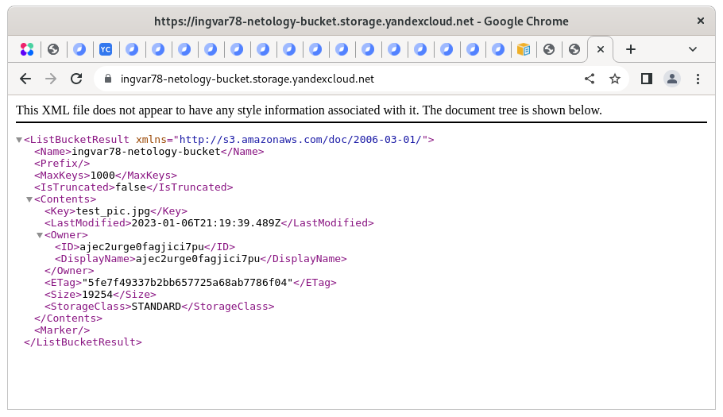

# Домашнее задание к занятию 15.3 "Безопасность в облачных провайдерах"
Используя конфигурации, выполненные в рамках предыдущих домашних заданиях, нужно добавить возможность шифрования бакета.

---
## Задание 1. Яндекс.Облако (обязательное к выполнению)
1. С помощью ключа в KMS необходимо зашифровать содержимое бакета:
- Создать ключ в KMS,
- С помощью ключа зашифровать содержимое бакета, созданного ранее.

[Создание ключа и шифрование](./15.3/kms)


```
va@c9v:~/Documents/15.3 $ yc storage bucket list
+--------------------------+----------------------+----------+-----------------------+---------------------+
|           NAME           |      FOLDER ID       | MAX SIZE | DEFAULT STORAGE CLASS |     CREATED AT      |
+--------------------------+----------------------+----------+-----------------------+---------------------+
| ingvar78-netology-bucket | b1gm6im3mcuc36r6kn8s |        0 | STANDARD              | 2023-01-06 22:34:08 |
+--------------------------+----------------------+----------+-----------------------+---------------------+
iva@c9v:~/Documents/15.3 $ yc kms symmetric-key list
+----------------------+----------+----------------------+-------------------+---------------------+--------+
|          ID          |   NAME   |  PRIMARY VERSION ID  | DEFAULT ALGORITHM |     CREATED AT      | STATUS |
+----------------------+----------+----------------------+-------------------+---------------------+--------+
| abjs2s6gok48hrpusiug | test-key | abjbvuutib5r8inctgot | AES_128           | 2023-01-06 22:34:05 | ACTIVE |
+----------------------+----------+----------------------+-------------------+---------------------+--------+
iva@c9v:~/Documents/15.3 $ yc storage bucket get ingvar78-netology-bucket
name: ingvar78-netology-bucket
folder_id: b1gm6im3mcuc36r6kn8s
anonymous_access_flags:
  read: true
  list: true
  config_read: true
default_storage_class: STANDARD
versioning: VERSIONING_DISABLED
created_at: "2023-01-06T22:34:08.519823Z"

```



2. (Выполняется НЕ в terraform) *Создать статический сайт в Object Storage c собственным публичным адресом и сделать доступным по HTTPS
- Создать сертификат,
- Создать статическую страницу в Object Storage и применить сертификат HTTPS,
- В качестве результата предоставить скриншот на страницу с сертификатом в заголовке ("замочек").

Документация
- [Настройка HTTPS статичного сайта](https://cloud.yandex.ru/docs/storage/operations/hosting/certificate)
- [Object storage bucket](https://registry.terraform.io/providers/yandex-cloud/yandex/latest/docs/resources/storage_bucket)
- [KMS key](https://registry.terraform.io/providers/yandex-cloud/yandex/latest/docs/resources/kms_symmetric_key)

Дополнительные материалы
- [Управление ключами KMS с Hashicorp Terraform](https://cloud.yandex.ru/docs/kms/tutorials/terraform-key#security)

--- 
## Задание 2*. AWS (необязательное к выполнению)

1. С помощью роли IAM записать файлы ЕС2 в S3-бакет:
- Создать роль в IAM для возможности записи в S3 бакет;
- Применить роль к ЕС2-инстансу;
- С помощью бутстрап скрипта записать в бакет файл web-страницы.
2. Организация шифрования содержимого S3-бакета:
- Используя конфигурации, выполненные в рамках ДЗ на предыдущем занятии, добавить к созданному ранее bucket S3 возможность шифрования Server-Side, используя общий ключ;
- Включить шифрование SSE-S3 bucket S3 для шифрования всех вновь добавляемых объектов в данный bucket.
3. *Создание сертификата SSL и применение его к ALB:
- Создать сертификат с подтверждением по email;
- Сделать запись в Route53 на собственный поддомен, указав адрес LB;
- Применить к HTTPS запросам на LB созданный ранее сертификат.

Resource terraform
- [IAM Role](https://registry.terraform.io/providers/hashicorp/aws/latest/docs/resources/iam_role)
- [AWS KMS](https://registry.terraform.io/providers/hashicorp/aws/latest/docs/resources/kms_key)
- [S3 encrypt with KMS key](https://registry.terraform.io/providers/hashicorp/aws/latest/docs/resources/s3_bucket_object#encrypting-with-kms-key)

Пример bootstrap-скрипта:
```
#!/bin/bash
yum install httpd -y
service httpd start
chkconfig httpd on
cd /var/www/html
echo "<html><h1>My cool web-server</h1></html>" > index.html
aws s3 mb s3://mysuperbacketname2021
aws s3 cp index.html s3://mysuperbacketname2021
```

